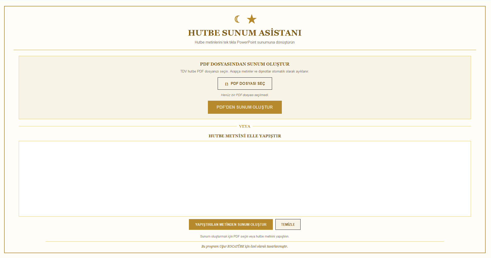

# 🕌 Hutbe Sunum Asistanı

<p align="center">
  
</p>


Hutbe Sunum Asistanı, Diyanet İşleri Başkanlığı tarafından yayımlanan cuma hutbelerini otomatik olarak PowerPoint sunumuna dönüştürmek amacıyla geliştirilmiş bir Windows masaüstü uygulamasıdır.

Bu uygulama sayesinde hutbe metni manuel olarak kopyalanıp slaytlara yerleştirilmez. Kullanıcı yalnızca PDF dosyasını seçer ve tek tıkla sunum oluşturabilir.

---

## 🚀 Özellikler

- 📄 Diyanet hutbe PDF'lerini otomatik okur.
- 📑 İki sütunlu PDF yapısını doğru işler.
- 🧹 Arapça metinleri ve gereksiz dipnotları temizler.
- ✂️ Metni cümlelere ayırır.
- 📊 Otomatik PowerPoint sunumu oluşturur.
- 🕌 Giriş görsellerini sunuma ekler.
- 📖 Her cümleyi ayrı slayta yerleştirir.
- 🖼️ Kapanış görsellerini sunuma ekler.
- 💻 Windows masaüstü uygulaması olarak çalışır.

---

## 🛠️ Kullanılan Teknolojiler

- Python
- Tkinter
- pdfplumber
- python-pptx
- Pillow
- PyInstaller

---

## 📂 Proje Yapısı

```text
HutbeSunumAsistani/
│
├── arayuz.py
├── main.py
├── pdf_oku.py
├── ppt_olustur.py
├── ayarlar.py
│
├── hutbe_sablonu.pptx
├── giris_gorselleri/
├── cikis_gorselleri/
│
├── README.md
├── requirements.txt
└── hutbe.ico
```

---

## 🚀 Kullanım

1. Programı çalıştırın.
2. Diyanet hutbe PDF dosyasını seçin.
3. **Sunumu Oluştur** butonuna tıklayın.
4. Sunum otomatik olarak masaüstüne oluşturulur.

---

## 💡 Projenin Hikâyesi

Bu proje, babamın her hafta cuma hutbesini PowerPoint sunumuna manuel olarak hazırlamak için harcadığı zamanı azaltmak amacıyla geliştirildi.

Başlangıçta kişisel bir ihtiyaç olarak ortaya çıkan proje, zamanla otomatik PDF okuma, sunum oluşturma ve Windows masaüstü uygulaması özellikleri eklenerek geliştirildi.

---

## 🔮 Gelecek Planları

- Farklı sunum şablonları
- Sürükle & bırak desteği
- Çoklu dil desteği
- Otomatik güncelleme sistemi

---

## 👨‍💻 Geliştirici **Göktuğ Kocatürk** - GitHub: https://github.com/goktug01-dev - LinkedIn: https://www.linkedin.com/in/g%C3%B6ktu%C4%9F-kocat%C3%BCrk-b8290b380/